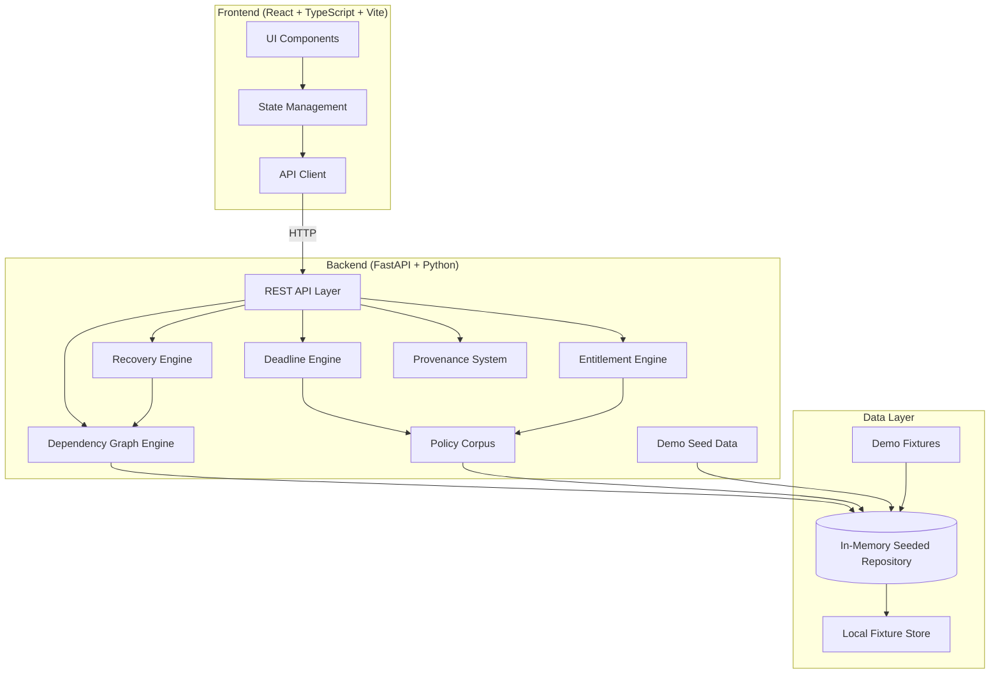
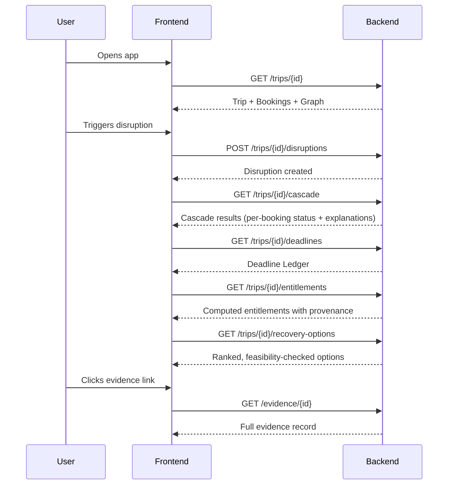
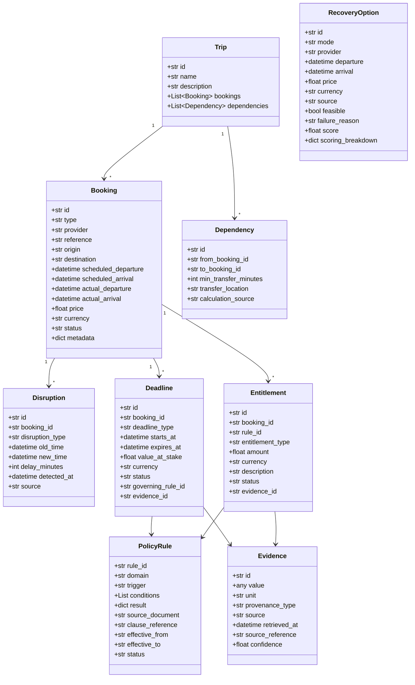
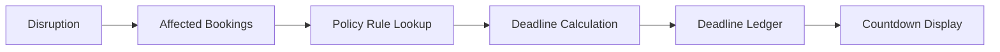

# SANDHI — Architecture

## System Overview

SANDHI is a travel disruption cascade analysis system. It models a traveller's itinerary as a temporal dependency graph and, when a disruption occurs, propagates the impact through downstream bookings, computes deadlines, calculates entitlements, and generates feasibility-verified recovery options.



## Architecture Decisions

### Seeded In-Memory Persistence (MVP)

For the MVP, we use an **in-memory seeded repository store** (`DataStore` in `backend/app/store.py`). This provides instant, zero-setup determinism, eliminates database setup friction, and allows instant reset/repeat testing. The repository pattern isolates the storage layer so it can be swapped to **PostgreSQL + PostGIS** for production deployments.

**MVP Persistence**: In-Memory Seeded Repository / Store with deterministic reset
**Production Persistence**: PostgreSQL + PostGIS (with temporal graph indexing and spatial queries)

### No AI/LLM Dependency for Core Decision Path

The entire MVP runs without any AI API keys or external model dependencies. "The model explains. The code decides." All graph propagation, slack calculation, deadline countdowns, entitlement evaluations, and recovery feasibility rankings are 100% deterministic code.

## Frontend / Backend Boundaries



## Data Flow

1. **Seed** → Demo data loaded into SQLite on startup
2. **Trip query** → Repository fetches trip, bookings, dependencies
3. **Disruption** → User triggers disruption via API
4. **Propagation** → Graph engine computes cascade using NetworkX
5. **Deadlines** → Deadline engine evaluates policy rules against affected bookings
6. **Entitlements** → Entitlement engine computes deterministic results from policy corpus
7. **Recovery** → Recovery engine generates candidates, runs feasibility simulation, ranks
8. **Provenance** → Every critical value carries evidence metadata
9. **Response** → Frontend renders cascade, deadlines, recovery, evidence

## Domain Model



## Dependency Graph Model

The itinerary is modeled as a **Directed Acyclic Graph (DAG)** using NetworkX.

- **Nodes** = Bookings
- **Edges** = Dependencies (temporal connections with minimum transfer times)

### Graph Construction

```python
G = nx.DiGraph()
for booking in trip.bookings:
    G.add_node(booking.id, booking=booking)
for dep in trip.dependencies:
    G.add_edge(dep.from_booking_id, dep.to_booking_id, dependency=dep)
```

### Topological Processing

Dependencies are processed in topological order to ensure upstream disruptions propagate before downstream feasibility is evaluated.

## Disruption Propagation Algorithm

```
1. Apply disruption to source booking (update actual times)
2. Get topological ordering of dependency graph
3. For each booking in topological order:
   a. Find all incoming dependencies
   b. For each incoming dependency:
      - Calculate: predecessor_arrival + min_transfer_minutes
      - Calculate: slack = booking_departure - (predecessor_arrival + min_transfer)
      - If slack < 0: mark INFEASIBLE, record explanation
      - If slack < threshold: mark AT_RISK, record explanation
      - If predecessor is INFEASIBLE: mark this INFEASIBLE (cascading)
   c. Propagate status to downstream nodes
4. Return cascade results with per-node explanations
```

### Status Values

| Status | Meaning |
|--------|---------|
| FEASIBLE | Connection is viable with positive slack |
| AT_RISK | Connection is viable but slack is dangerously small (<15 min) |
| INFEASIBLE | Connection is broken — arrival + transfer > departure |
| MISSED | Booking departure has passed |
| FORFEITED | Non-transport booking that cannot be used due to timing |
| DELAYED | Source booking is delayed but still usable |

## Deadline Engine

The Deadline Engine evaluates policy rules against affected bookings to produce deadline objects.



### Deadline Resolution Process

1. Identify affected booking
2. Look up applicable policy rules by booking type and disruption type
3. Evaluate rule conditions
4. Calculate deadline timestamps deterministically
5. Calculate value at stake
6. Create Deadline object with evidence reference

### Determinism Guarantee

All deadline calculations use:
- Fixed policy rules from the corpus
- Deterministic time arithmetic
- No AI/ML input

## Entitlement Engine

Computes traveller entitlements from the policy corpus.

### Supported Rule Domains (MVP)

- **Railway**: Indian Railway refund rules for missed connections
- **Aviation**: DGCA passenger rights (verified subset)
- **Hotel**: Demo cancellation policies
- **Attraction**: Demo refund policies

### Rule Evaluation

```python
def evaluate_rule(rule: PolicyRule, booking: Booking, disruption: Disruption) -> Entitlement:
    if not check_conditions(rule.conditions, booking, disruption):
        return None
    amount = compute_amount(rule.result, booking)
    return Entitlement(
        rule_id=rule.rule_id,
        amount=amount,
        status="SUPPORTED" if rule.status == "VERIFIED" else "NOT_SUPPORTED",
        evidence_id=create_evidence(rule)
    )
```

### Unsupported Rules

If a rule cannot be verified, the entitlement is returned with `status = NOT_SUPPORTED` and no amount.

## Recovery Engine

### Candidate Generation

For MVP, recovery candidates are pre-seeded fixture data representing alternative trains, rebooking options, etc.

### Feasibility Simulation

```
For each candidate:
  1. Clone the current itinerary graph
  2. Replace the affected booking with the candidate
  3. Re-run propagation on the modified graph
  4. If all downstream bookings remain feasible → candidate is feasible
  5. If any downstream booking breaks → candidate is NOT feasible (record reason)
```

### Ranking

```
score = (w_time × time_penalty)
      + (w_cost × cost_penalty)
      + (w_disruption × disruption_penalty)
      + (w_feasibility × feasibility_bonus)
```

Weights and scoring logic are transparent and displayed to the user.

## Provenance Model

### Provenance Types

| Type | Description |
|------|-------------|
| REAL_OBSERVATION | Directly observed from a live source |
| HISTORICAL | From historical data |
| CACHE | From cached data with retrieval timestamp |
| PUBLISHED_RULE | From a verified policy document |
| MODEL_PREDICTION | From an ML model (not used in MVP) |
| ESTIMATE | Calculated estimate |
| DEMO_FIXTURE | Demo seed data, not live |

### Evidence Object

Every critical value references an Evidence object:

```json
{
  "id": "ev_001",
  "value": 1240,
  "unit": "INR",
  "provenance_type": "PUBLISHED_RULE",
  "source": "Indian Railway Refund Rules",
  "retrieved_at": "2026-08-31T12:00:00Z",
  "source_reference": "Rule 7(2)(b)",
  "confidence": 1.0
}
```

## Policy Corpus

### Structure

```
data/policies/
├── railway/
│   ├── refund_rules.json
│   └── source_documents/
├── aviation/
│   ├── dgca_car.json
│   └── source_documents/
├── hotel/
│   └── demo_policies.json
└── attraction/
    └── demo_policies.json
```

### Rule Format

```json
{
  "rule_id": "RAIL_REFUND_001",
  "domain": "railway",
  "trigger": "MISSED_CONNECTION",
  "conditions": [
    {"field": "booking_type", "operator": "eq", "value": "train"},
    {"field": "disruption_cause", "operator": "eq", "value": "connecting_delay"}
  ],
  "result": {
    "entitlement_type": "TDR_REFUND",
    "description": "Refund via TDR for missed connection"
  },
  "source_document": "Indian Railway Passenger Fare Refund Rules",
  "clause_reference": "See applicable section",
  "effective_from": "2024-01-01",
  "effective_to": null,
  "status": "VERIFIED_STRUCTURE"
}
```

## Data Adapters

### Adapter Pattern

```python
class DataAdapter(Protocol):
    async def get_flight_status(self, flight_number: str, date: str) -> FlightStatus: ...
    async def get_train_status(self, train_number: str, date: str) -> TrainStatus: ...
```

### Implementations

- **DemoAdapter**: Returns fixture data (default for MVP)
- **LiveAdapter**: Calls external APIs (future)
- **CacheAdapter**: Wraps LiveAdapter with file-based caching (future)

## Caching

For MVP, all data is seeded from fixtures. The architecture supports:

1. **File-based cache**: JSON files in `data/cache/`
2. **TTL-based invalidation**: Cached data carries timestamps
3. **Graceful fallback**: If live API fails → use cache → use fixture

## Offline Mode

The application starts in **DEMO mode** by default:

- All data comes from fixtures
- No external API calls
- No API keys required
- Full functionality available

Environment variable `SANDHI_MODE=live` enables live API adapters.

## API Structure

| Endpoint | Method | Description |
|----------|--------|-------------|
| `/health` | GET | Health check |
| `/trips/{trip_id}` | GET | Get trip with bookings |
| `/trips/{trip_id}/graph` | GET | Get dependency graph |
| `/trips/{trip_id}/disruptions` | POST | Create a disruption |
| `/trips/{trip_id}/cascade` | GET | Get cascade analysis |
| `/trips/{trip_id}/deadlines` | GET | Get Deadline Ledger |
| `/trips/{trip_id}/entitlements` | GET | Get computed entitlements |
| `/trips/{trip_id}/recovery-options` | GET | Get recovery options |
| `/evidence/{evidence_id}` | GET | Get evidence record |

## Database Structure (MVP)

SQLite with tables:

- `trips`
- `bookings`
- `dependencies`
- `disruptions`
- `deadlines`
- `policy_rules`
- `entitlements`
- `recovery_options`
- `evidence`

All seeded from JSON fixture files on startup.

## Security Considerations

- No API keys hardcoded
- `.env.example` provided
- All external input validated via Pydantic
- No secrets in frontend code
- Internal errors not exposed to client

## Testing Strategy

### Unit Tests
- Graph construction and propagation
- Deadline calculation
- Entitlement rule evaluation
- Recovery feasibility checking
- Provenance attachment

### Integration Tests
- Full disruption → cascade → deadline → entitlement → recovery flow
- API endpoint tests
- Seed data validation

### Deterministic Scenario Tests
- Demo scenario produces expected results
- Edge cases (zero slack, negative slack, cascading failures)

## Future Scaling Path

1. **PostgreSQL/PostGIS**: Replace SQLite for multi-user, geospatial queries
2. **Redis**: Add caching layer for live API responses
3. **Celery/Background workers**: Async disruption monitoring
4. **WebSocket**: Real-time deadline countdown updates
5. **Mobile app**: React Native or Flutter
6. **ML models**: Delay prediction using historical data
7. **Semantic search**: Policy corpus search with embeddings

## What Is Deterministic vs AI-Assisted

| Component | Deterministic | AI-Assisted |
|-----------|:---:|:---:|
| Graph propagation | ✅ | ❌ |
| Deadline computation | ✅ | ❌ |
| Entitlement calculation | ✅ | ❌ |
| Feasibility checking | ✅ | ❌ |
| Recovery ranking | ✅ | ❌ |
| Monetary calculations | ✅ | ❌ |
| Policy extraction (future) | ❌ | ✅ |
| Result summarization (future) | ❌ | ✅ |
| Complaint drafting (future) | ❌ | ✅ |
